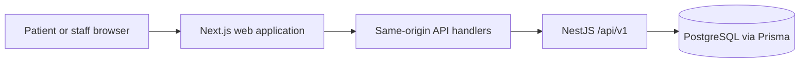

# Architecture

The browser uses React Query for server state and Zustand for navigation state. shadcn/Radix components supply accessible form and dialog primitives; Tailwind and shared CSS define the interface.

The Next.js server stores the API JWT in an HttpOnly, SameSite=Strict cookie, setting Secure in production. It forwards that JWT to NestJS as a bearer token, never to client JavaScript. Mutating browser requests must match `APP_ORIGIN`. The route allowlist prevents arbitrary upstream proxying. React Query caches are cleared on login/logout.

NestJS uses globally enforced JWT and role guards, explicit public routes, strict DTO validation, a response envelope and redacted error responses. `AuthModule`, `UsersModule`, `DatabaseModule`, `HospitalModule` and `HealthModule` cover the current milestone. Further hospital modules can be split from `HospitalModule` as their requirements grow.

Protected requests fetch the current user from PostgreSQL, so demotions apply to already-issued JWTs. Public registration cannot choose a role. Passwords use Argon2id; tokens expire in 15 minutes. Logout clears the browser cookie but does not revoke a stolen bearer token; centralized revocation remains a production requirement.

Booking locks the doctor row in a transaction before checking duplicates/capacity and assigning the next serial. Queue changes use the same lock. Serials are never reused after cancellation. Times are interpreted in Asia/Dhaka and visit dates are PostgreSQL DATE values.

Official implementation references: [Nest authentication](https://docs.nestjs.com/security/authentication), [Prisma transactions](https://docs.prisma.io/docs/orm/v7/prisma-client/queries/transactions), [Next.js cookies](https://nextjs.org/docs/app/api-reference/functions/cookies).
